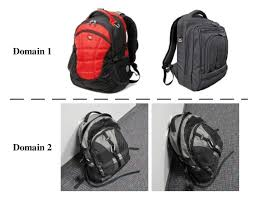

# Welcome {.title-slide}

::: {.small .muted}
A 'masterclass-style' computer vision workshop (image classification)
:::

## What you'll leave with

- A clear understanding of **computer vision** and its sub-tasks
- Confidence choosing between **classification / detection / segmentation**
- Practical understanding of **training, validation, deployment**
- Awareness of **domain shift, transfer learning, foundational models, ensembles**
- Python **code gists** you can adapt
- Short demos of **Roboflow Notebooks + Roboflow Universe**
- A direct line to the Data Sicence CRP for your own project


## Ground rules

::: {.callout-tip}
Ask as we go. 
:::

::: {.callout-warning}
Code in these slides is illustrative.
:::

::: {.callout-note}
Most of the theory will be paired with Python examples so you can see how the idea lands in practice.
:::


# 1 · Computer Vision

## What is computer vision?

::: {.cols}
::: {.col}
- Teaching computers to extract meaning from pixels
- Models learn spatial patterns inside an image (edges → textures → parts → objects)
- Modern computer vision is dominated by deep neural networks (CNNs, Vision Transformers)
:::
::: {.col}

^[Image obtained from Algotive]
:::
:::

## Computer vision applications


^[Image obtained from [Roboflow's website](https://roboflow.com).]

## What is Roboflow
Roboflow is a platform for computer vision projects. It provides tools for:

- **Data management** — upload, annotate, version control
- **Model training** — pre-trained backbones, transfer learning, custom training loops
- **Validation and Testing** — metrics, confusion matrices, error analysis
- **Deployment** — hosted inference, API, edge deployment

https://roboflow.com/ 

## Why use Roboflow?
There are many apps and tools that are making computer vision more accessible. From experience, Roboflow is the most comprehensive and user-friendly for end-to-end projects. 

::: {.callout-warning}
Some of the advanced features (e.g. hosted inference) are paid, but the free tier is generous enough for most research projects.
:::

::: {.callout-warning}
UQ or the Data Science CRP do not have any financial relationship with Roboflow. I just genuinely like their product and use it in my projects. Many people at UQ use it and have had good experiences.
:::


## The computer vision workflow
```{mermaid}
flowchart TD
    A[Define task] --> B[Data]
    B --> C[Train]
    C --> D[Val and Test]
    D --> C 
    D --> E[Deploy]
```


## Other aspects of computer vision

::: {.cols}
::: {.col}
[Data]{.badge}
High quality, labelled data is most important 'asset' in computer vision.
:::
::: {.col}
[Compute]{.badge .orange}
AI is becoming more accessible, adding more pressure into processing infrastructure. 
:::
::: {.col}
[Models]{.badge .green}
There are many pre-trained or foundation models you can already download. 
:::
:::

::: {.keybox}
You almost never need to train a model from scratch. Assume there is a pre-trained model that already does 70% of your job.
:::


# 2 · Classification vs Detection vs Segmentation

## The three core CV tasks
There are three core CV tasks that cover most use cases. They differ in the specificity of their output. 

| Task | Output | Answers | Typical use |
|---|---|---|---|
| **Classification** | One (or many) labels per image | *What is in this image?* | Species ID, quality control |
| **Object detection** | Labels + bounding boxes | *What and where?* | Counting, tracking, surveillance |
| **Segmentation** | Per-pixel labels (mask) | *What, where, exact shape?* | Medical imaging, area/biomass |

::: {.callout-warning}
Cost scales with task type. Segmentation tasks are more expensive than classification tasks.
:::

---

## Visual examples

{width="100%"}

^[Image obtained from Reddit r/ComputerVision]

::: {.keybox}
Image classification is = Image Recognition
:::

## Visual examples (cont.)
This is how the model 'sees' the data and what it learns to output for each task. 

::: {.cols}
::: {.col .center .small}
**Classification**<br>
`{label: 'cat', conf: 0.94}`
:::
::: {.col .center .small}
**Detection**<br>
`[{label:'cat', bbox:[x1,y1,x2,y2], conf:0.91}]`
:::
::: {.col .center .small}
**Segmentation**<br>
`mask: ndarray[H,W] of class ids`
:::
:::

The `conf` scores are the model's confidence in its prediction. More information on this in the validation and testing section.

---

## Code: three tasks, three one-liners (Roboflow)
Roboflow has several python libraries to make it easy to pull pre-trained models and run inference on your images. In here we show how to use `inference`. 

```python
from inference import get_model

# --- Classification — cell type from microscopy image ---
cls   = get_model("cell-type-classifier/1").infer("slide.jpg")[0]

# --- Detection — locate nuclei with bounding boxes ---
dets  = get_model("nuclei-detection/2").infer("slide.jpg")[0]

# --- Segmentation — pixel-level cell masks via SAM 2 ---
masks = get_model("sam2/hiera_small").infer("slide.jpg")[0]
```

::: {.callout-note}
`get_model("owner/version")` pulls any model from Roboflow Universe (more info on this later)
:::

---

## Which task for which question?

::: {.keybox}
Start from the decision you want to make; work out the minimum output that enables it.
:::

| Domain | Question | Task |
|---|---|---|
| **Traffic** | *Is this vehicle a car, bus, or truck?* | **Classification** |
| **Microscopy (health)** | *How many nuclei are in this slide?* | **Detection** |
| **Agriculture** | *What fraction of the canopy is affected by disease?* | **Segmentation** |


# 3 · Collecting & Labelling Data
---
```{mermaid}
flowchart TD
    A["Define task ✅"] --> B[Data]
    B --> C[Train]
    C --> D[Val and Test]
    D --> C 
    D --> E[Deploy]
```
---

## The data-centric mindset
Data is the foundation of computer vision. A better dataset beats a better model every time.

{width="100%"}

^[Image obtained from DeepLobe]

## Moving away from manual labelling
In the early days of computer vision, labelling was a purely manual process. Now we can leverage **semi-automated labelling** techniques to speed up the annotation process. 

For example we can ask 'foundational models' like 'CLIP' or 'SAM' to find and label your object of interest in an image.

::: {.callout-important}
In some situations manual labelling is still necessary - for those highly domain-specific tasks where pre-trained models struggle. 
:::

## General examples of manual vs automated labelling
| Manual labelling | Semi-automated labelling |
|---|---|
| Detecting coral bleaching in a location where AI has never been trained before | Detect coral reefs and classify it into species / genus |
| Classifying plant diseases from leaf images | Segment parts of a plant (leaf, trunk, fruit etc) |


## 'Rapid' in Roboflow
Semi-automated labelling in action 

<video controls autoplay muted loop width="100%">
  <source src="assets/rapid_demo.webm" type="video/webm">
</video>

^[Video obtained from [Roboflow's website](https://roboflow.com).]


## Other cool features in Roboflow (re to data collection & labelling)
- You can upload and annotate data collected 'live' in your mobile
- Accepts images, videos, pdfs, etc 

{width="100%"}

^[Screenshot obtained from [Roboflow's website](https://roboflow.com).]


## Roboflow Universe: pre-labelled datasets & pre-trained models
Roboflow Universe is a public repository of datasets and models. You can search for a dataset/model that matches your problem, and either use it directly or fine-tune it on your data.

 💡Lets have a quick look at the website and see what's there - https://universe.roboflow.com/

# 3 · Training, Validation & Testing
---
```{mermaid}
flowchart TD
    A["Define task ✅"] --> B["Data✅"]
    B --> C[Train]
    C --> D[Val and Test]
    D --> C 
    D --> E[Deploy]
```
---


## The three-split doctrine
Once you have labelled data you need to split the data into three sets: Train, Validation, and Test. Each set has a specific purpose in the model development lifecycle.

```{mermaid}
flowchart LR
    D[Labelled data] --> T[Train ~70%]
    D --> V[Val ~15%]
    D --> S[Test ~15%]
    T -->|fit weights| M[Model]
    V -->|tune hyperparams| M
    S -->|final metric| R[Final result]
```

::: {.callout-important}
The **test set is sacred**. Use it when you are ready to test / report your final results. 
:::

## How to select data for each split?
- **Random split** — simple and easy to do but problematic if there are correlations (e.g. same site, date, camera)
- **Stratified split** — ensures labelled data is balanced in each set, but difficult to apply if you have many classes
    - Training
        - 100 images for disease A
        - 100 images for disease B
    - Validation
        - 20 images for disease A
        - 20 images for disease B

## Adding variability to your splits
Models only learn from the data you show them. If your training set is too narrow, your model will fail when it sees something new in the real world.

::: {.callout-warning}
This is one of the most common sources of "it worked in the lab but fails in the field" problems. 
:::

## How to *actually* train a model?
There are many frameworks and libraries to train models, but here is classic object detection example

```python
from roboflow import Roboflow
from ultralytics import YOLO
import supervision as sv

# 1. pull dataset
dataset = Roboflow(api_key="YOUR_KEY") \
    .workspace("my-workspace") \
    .project("my-detection-project") \
    .version(1).download("yolov8")

# 2. train
model = YOLO("yolov8n.pt")
model.train(data=f"{dataset.location}/data.yaml", epochs=30, imgsz=640)

```
## How to *actually* train a model? (cont.)
In Roboflow, its all point and click tools. Plenty of options, tutorials and code (if you want to do it yourself).

{width="100%"}
^[Screenshot obtained from [Roboflow's website](https://roboflow.com).]

---
{width="100%"}
^[Screenshot obtained from [Roboflow's website](https://roboflow.com).]
---

---
{width="100%"}
^[Screenshot obtained from [Roboflow's website](https://roboflow.com).]
---


## A quick overview of model frameworks
| # | Model | Type | Strengths | Best For |
|---|---|---|---|---|
| 🥇 | **YOLO26** | Detection / Multi-task | Fastest edge inference, NMS-free, multi-task | IoT, robotics, real-time apps |
| 🥈 | **YOLOv12** | Detection | Best accuracy, attention-centric | Research & benchmarking |
| 🥉 | **RF-DETR** | Detection / Segmentation | Best cross-domain generalisation | Medical, infrastructure |
| 4 | **OpenCV** | Classical CV | No ML needed, rock-solid preprocessing | Pipelines, rule-based vision |
| 5 | **SAM 2** | Segmentation | Zero-shot, no labels needed | Healthcare, geospatial |
| 6 | **Detectron2** | Detection / Segmentation | Modular, research-grade PyTorch | Academic, satellite imagery |
| 7 | **DINOv2** | Self-supervised ViT | Rich features, no labels | Scarce data, fine-grained tasks |
| 8 | **CLIP** | Vision-Language | Image + text, zero-shot classification | Search, e-commerce, multimodal |
| 9 | **EfficientNet** | Classification | Lightweight, mobile-friendly | Mobile, edge, IoT |
| 10 | **TensorRT / ONNX** | Inference Optimization | Max speed on any hardware | Production deployment |

## How to interpret evaluation and testing results?
{width="100%"}
^[Image obtained from [Roboflow's website](https://roboflow.com).]

## Precision, recall and F1 
- **Precision**: Of all the positive predictions, how many were correct? (TP / (TP + FP))
- **Recall**: Of all the actual positives, how many did we correctly identify? (TP / (TP + FN))
- **F1 Score**: The harmonic mean of precision and recall. It balances the two metrics. (2 * (Precision * Recall) / (Precision + Recall))


## The accuracy trap
Accuracy can be misleading, especially with imbalanced datasets. For example, if 95% of your data belongs to one class, a model that always predicts that class will have 95% accuracy but will fail to identify the minority class.

{width="100%"}
^[Image obtained from Towards Data Science]

## What to do when accuracies are not acceptable?
- **Collect more data** — especially for underrepresented classes
- **Data augmentation** — artificially increase dataset size by applying transformations (rotation, flipping, color jitter)

{width="100%"}
^[Image obtained from Towards Data Science]


## Dealing with confidence scores
Most models output a confidence score for each prediction/inference. It's important to choose an appropriate threshold for these scores to balance precision and recall according to your specific use case.

::: {.cols}
::: {.col .center .small}
**Classification**<br>
`{label: 'cat', conf: 0.94}`
:::
::: {.col .center .small}
**Detection**<br>
`[{label:'cat', bbox:[x1,y1,x2,y2], conf:0.91}]`
:::
::: {.col .center .small}
**Segmentation**<br>
`mask: ndarray[H,W] of class ids`
:::
:::

## Dealing with confidence scores (cont.)

::: {.cols}
::: {.col .small .center}
**🔽 Low threshold (e.g. 0.2)**

Accepts many predictions, even uncertain ones.

*Use when missing a case is costly*
*(e.g. disease screening)*
:::
::: {.col .small .center}
**⚖️ Balanced threshold (e.g. 0.5)**

Accepts predictions the model is fairly sure about.

*Tune from here based on your use case*
:::
::: {.col .small .center}
**🔼 High threshold (e.g. 0.9)**

Only accepts very confident predictions.

*Use when a false alarm is costly*
*(e.g. automated actions)*
:::
:::

---
::: {.small .muted}
Let's take a 10 minute break!
:::
---

# 4 · Domain Shift, Transfer Learning & Foundational Models
---
```{mermaid}
flowchart TD
    A["Define task ✅"] --> B["Data✅"]
    B --> C[Train✅]
    C --> D[Val✅ and Test✅]
    D --> C 
    D --> E[Deploy]
```
---

## Issues and solutions for real-world deployment
- **Domain shift** → monitor and adapt
- **Transfer learning** → leverage pre-trained models
- **Foundational models** → zero-shot or few-shot with large pre-trained models

## Domain shift: the silent killer of CV projects
::: {.keybox}
**Domain shift** = when the distribution of data at deployment differs from the distribution at training.
:::

{width="100%"}

^[Image obtained from ResearchGate]

## Why domain shift is a problem
Models learn patterns in the training data. If the deployment data looks different, those patterns may not hold, leading to poor performance.

To solve this, you need to monitor when domain shift occurs and adapt your model or data collection strategy accordingly.

## Transfer learning: a powerful tool to combat domain shift
Transfer learning allows you to take a model trained on one dataset and fine-tune it on a smaller dataset from the new domain. This can help your model adapt to the new data distribution without needing to train from scratch.

{width="100%"}
^[Image obtained from Linkedin]

## Foundational models: the new frontier
Foundational models are large pre-trained models that can be used for a wide range of tasks with little to no fine-tuning. They are trained on internet-scale data and can often generalize well to new domains.

{width="100%"}

^[Image obtained from [Roboflow's website](https://roboflow.com).]


# 5 · Deployment

## What "deployment" actually means
Deployment is not just about putting a model in production. It encompasses the entire lifecycle of maintaining and improving a model after it's been deployed.

Lets display this in Roboflow

---
{width="100%"}
^[Screenshot obtained from [Roboflow's website](https://roboflow.com).]

---


## Active learning: a human-in-the-loop approach to deployment
Active learning is a strategy where the model identifies uncertain predictions and requests human feedback to improve its performance

---

# 6 · Ensembles & Workflows

## Ensembles: combining multiple models

- Different models make **different mistakes**
- Averaging reduces **variance**
- Typical gain: +1-5% accuracy, "for free"

{width="100%"}
^[Image obtained from IBM]


# 7· AI vs Expertise

## A simplified list of things you can do manually, with Roboflow or with expertise:
| Task | Manual / Code | Roboflow | Need an Expert |
|---|---|---|---|
| **Data Collection** | Scrape, photograph, organise yourself | Upload, version, collaborate in UI | When data is complex, sensitive or scarce |
| **Data Labelling** | LabelImg, CVAT, manual annotation | Built-in labelling tool + auto-label (SAM) | Large-scale or medical-grade annotation |
| **Data Augmentation** | Albumentations, imgaug in code | One-click augmentation presets in UI | Custom domain-specific augmentation strategies |
| **Model Training** | PyTorch / YOLO CLI, manage compute yourself | Train YOLO, RF-DETR etc. in UI or via API | Custom architectures, fine-tuning foundation models |
| **Eval & Testing** | Write mAP, confusion matrix scripts manually | Auto metrics dashboard, visual eval tools | Statistical analysis, edge case testing, bias audits |
| **App Development** | Build Flask/FastAPI inference server from scratch | Roboflow Inference SDK + hosted API | Scalable backend, auth, multi-model pipelines |
| **Deployment (Cloud)** | Docker, AWS/GCP setup, manage endpoints | One-click deploy to hosted inference endpoint | High availability, autoscaling, enterprise SLAs |
| **Deployment (Edge)** | Export ONNX/TensorRT, flash device manually | Export-ready models + Inference on Jetson/RPi | Custom hardware, optimisation, quantisation |
| **Model Monitoring** | Build custom logging and drift detection | Dataset health checks, re-labelling workflows | Production drift monitoring, automated retraining |
| **Team Collaboration** | Git, shared drives, manual versioning | Workspaces, dataset versioning, role management | MLOps pipelines, CI/CD for models |


# 8 · How DS-CRP Can Help

## The Data Science Central Research Platform

The **DS-CRP** is UQ's centralised data-science support team. We exist to help researchers across the university move from *"I have data and an idea"* to *"I have a reproducible, evaluated, deployable result."*

::: {.cols}
::: {.col .small}
**We can help with**

- Framing the CV problem
- Dataset strategy & annotation plans
- Model selection & training
- Evaluation design (beyond F1!)
- Deployment advice
- Reproducibility, version control, MLOps
:::
::: {.col .small}
**How we work**

- Free short consultations
- Project scoping sessions
- Hands-on collaboration
- Training and upskilling
- Cost-recovery model for hands-on support
:::
:::


---

## Book a consultation — it's free

::: {.center}

[➜ Book a short consultation](https://forms.office.com/pages/responsepage.aspx?id=z3fjtrOdy0aRovrZYFuxXHrMWx_fw6JJmXvfvvf8jRBUMk9PUVJaVjUzWFNUQkdZWkQxRDUyTTFROSQlQCN0PWcu&origin=lprLink&route=shorturl)

:::


::: notes
Pragmatic note: in industry, ensembles are often avoided because of latency. In research, use them shamelessly — they're a free accuracy boost. TTA is the cheapest ensemble of all (no extra training).
:::


# 9 · Practical Demos

## What we'll do next (30 min)

1. **Roboflow Notebooks + Google Colab** (~15 min)
   - Open a prepared notebook
   - Train a classification model on a small dataset
   - Evaluate + download weights
2. **Roboflow Universe** (~15 min)
   - Browse public datasets & models
   - Use a pre-trained model for inference
   - Fork a dataset and adapt it to your own project


# Wrap-up

## Recap

::: {.small}
- **CV** = learning functions from pixels to structured outputs
- **Classification / Detection / Segmentation** — pick the minimum task
- **Train / Val / Test** — test set is sacred, group-aware splits matter
- **Domain shift** is the #1 real-world failure; mitigate with a little fine-tuning
- **Transfer learning** turns big problems into small ones
- **Foundational models** (CLIP / SAM / GroundingDINO) are a free head-start
- **Ensembles & workflows** often beat a bigger model
- **Know when to DIY vs call DS-CRP**
:::


## Take these with you

- **DS-CRP consultation** — [booking form](https://forms.office.com/pages/responsepage.aspx?id=z3fjtrOdy0aRovrZYFuxXHrMWx_fw6JJmXvfvvf8jRBUMk9PUVJaVjUzWFNUQkdZWkQxRDUyTTFROSQlQCN0PWcu&origin=lprLink&route=shorturl)
- **Roboflow Universe** — universe.roboflow.com
- **HuggingFace Models** — huggingface.co/models

::: {.center}
## Thank you 🙏

**s.lopezmarcano@uq.edu.au**
:::

